# GAWPS

_GAWPS_ is a collection of computational routines intended to carry out wellbore profiling and graphical analysis for flow unit detection in reservoir models. This acronym stands for _Graphical Analysis for Well Placement Strategy_.

## Purpose 

GAWPS was incepted to be an add-on module for the Matlab Reservoir Simulation Toolbox ([MRST]()), managed and released by SINTEF/Norway. It can be applied by geologists, petrophysicist, engineers and people involved with petrophysical analysis for analysis, data visualization, research, and teaching purposes.

## Dependencies

- MRST core module
- Mathworks MATLAB core and _Statistics and Machine Learning Toolbox

## Authorship

GAWPS was developed by Thiago Ney E. Rodrigues under the advisory of Dr. Gustavo Peixoto de Oliveira, at Petroleum Engineering Modeling Laboratory ([LaMEP](http://lamep.ci.ufpb.br)), Federal University of Paraíba, Brazil.

## Background information

### Hydraulic flow units

Under the realm of reservoir engineering, graphical methods have been developed to understand the stratigraphy observed in wells and assist experts in estimating rock quality, defining limits for barriers, baffles, and speed zones. In particular, much interested is devoted to delineating hydraulic flow units. 

The _hydraulic flow unit_ (HFU) is a concept intended to repre- 83 sent property variability in a facies model. [Amaefule et al. (1993)](https://doi.org/10.2118/26436-MS) define a HFU as 

> _"the representative elementary volume (REV) of total reservoir rock within which geological and petrophysical properties that may affect fluid flow are internally consistent and predictably different from other rock volumes.”_

However, HFUs have a wide-ranging spectrum of application, and as discussed by [Cannon (2015)](https://www.wiley.com/en-us/Petrophysics%3A+A+Practical+Guide-p-9781118746745), there is a semantic variability in what an HFU refers to:

- to a geologist: a definable 3D facies object, such as a fluvial channel or a carbonate shoal;
- to a petrophysicist: a 2D correlatable zone with similar petrophysical properties; and
- to a reservoir engineer: 3D reservoir layer that has a con- sistent dynamic response in the reservoir simulator.

To a reservoir modeller, however, an HFU is all these things.

From a geological viewpoint, there is a subtle distinction between facies and flow units. They can match, but this is not true for all cases, e.g., as illustrated by the petroleum system depicted in Figure below, adapted by the authors from (Ebanks, 1992) after (Hearn, 1984). It represents the cross section of a stratigraphic sequence of facies (top) and respective flow units (bottom). 

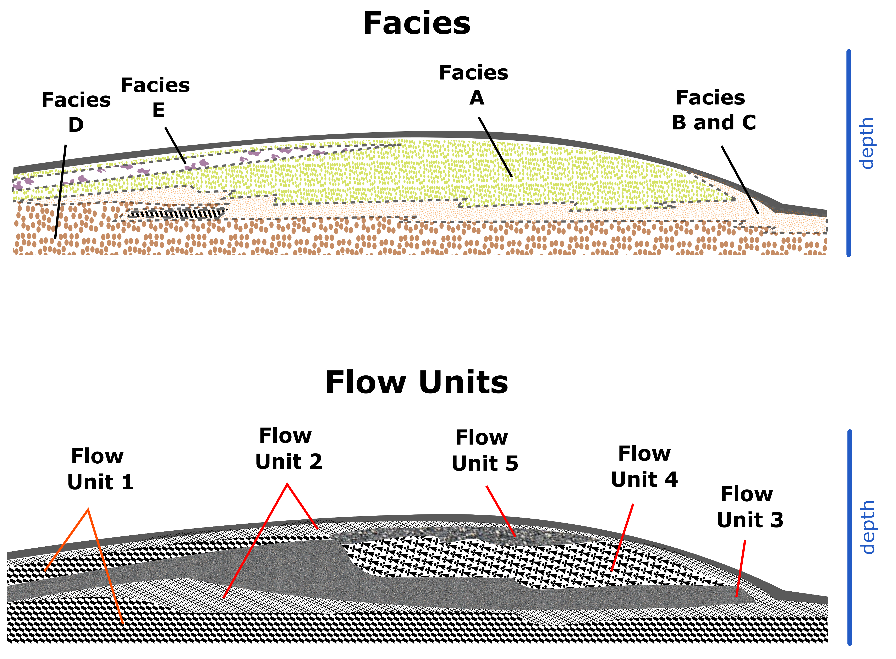

This scheme shows that, due to the variable character of rock and flow properties, flow units and facies may have cover different domains, thereby resulting in unmatched boundaries. Facies A, for instance, is composed not only by a single unit, but by flow units 3, 4, and 5. 

### Graphical methods

There is a large class of methods used to identify flow units in oilfields. Many of these methods are inherently statistical, either
linked to histogram analysis and probability plots or linear regression and clustering. 

## Applications

GAWPS provides specialized functions for the following methods:

- Classic Lorenz Plot (CLP)
- Modified Lorenz Plot (MLP)
- Winland Plot (WP)
- Histogram and Normal Probability Plot (NPP), adapted from Matlab
- Stratigraphic Modified Lorenz Plot (SMLP)
- Normalized Cumulative Flow Capacity Plot (NCFCP)
- Normalized Rock Quality Index Plot (NRQIP)
- Derivative Stratigraphic Modified Lorenz Plot (DSMLP)

See diagram below:

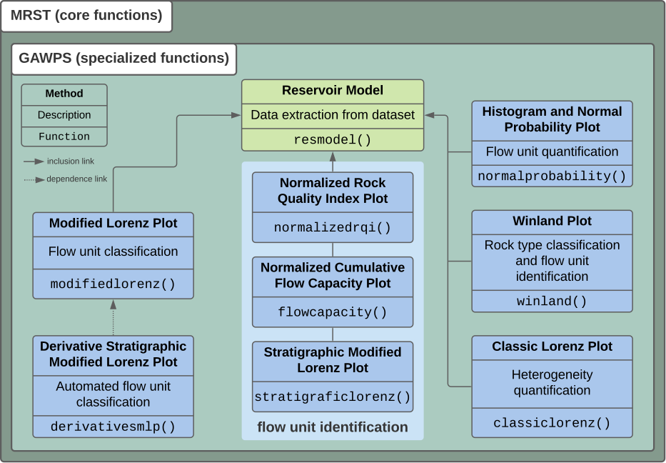

## How to get started

Download all script files and run the example files over well-known benchmark models to get started:

- [`ex0.m`](ex0.m): SPE 10
- [`ex1.m`](ex1.m): UNISIM-I (CEPETRO/UNICAMP - Brazil)
- [`ex2.m`](ex2.m): UNISIM-II (CEPETRO/UNICAMP - Brazil)
- [`ex3.m`](ex3.m): Egg
- [`ex4.m`](ex4.m): Norne Field

## Funding

This work was funded by the Federal University of Paraíba under the 2019-2020 CNPq/Brazil Junior Research Program.

## Publications

A previous version of GAWPS was used for this conference [paper](https://www.researchgate.net/publication/349641619_Metodos_Graficos_para_Delineamento_de_Unidades_de_Fluxo_em_Reservatorios_Petroliferos?_sg=OBhrisSgkA3DYQxHOaD7i-Y6ZZU7T1enwLwBBX3kKBz1DGOjn_zLFRyhnNQ7lfKbppZ1xRg1MD7x8KwgTrS8Aau2fynfugbyt0rtiFFw.G16HfoEVe51YFcGfhOd_ZtagtV4zekJLD2c5Hz6cBcmjDNuBBjPN_t8tx_YPc0es_nbjuNYAgOqglzXgGaLBtQ).

## Acknowledgments

We are grateful to Dr. K-A. Lie at SINTEF, Norway.

## References

Related papers by our group:

- DOI: [10.1016/j.petrol.2020.107730](https://doi.org/10.1016/j.petrol.2020.107730)
- DOI: [10.1016/j.petrol.2019.106732](https://doi.org/10.1016/j.petrol.2019.106732)
- DOI: [10.1016/j.petrol.2019.106680](https://doi.org/10.1016/j.petrol.2019.106680)
- DOI: [10.1016/j.petrol.2017.06.016](https://doi.org/10.1016/j.petrol.2017.06.016)
- DOI: [10.1016/j.petrol.2016.06.008](https://doi.org/10.1016/j.petrol.2016.06.008)

## Gallery

Find below a few plots produced by GAWPS processing

#### SPE10 Model

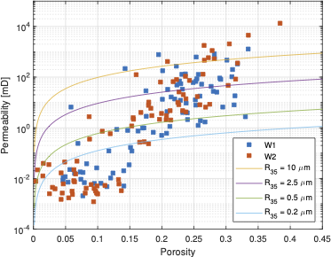

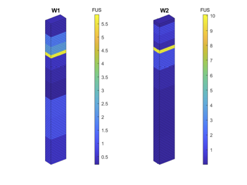
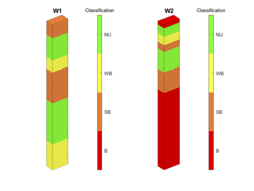
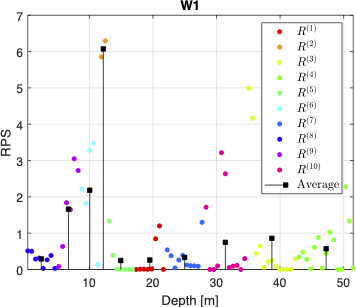

### UNISIM-I-D (Namorado Field)

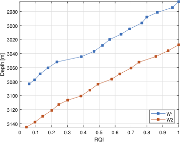
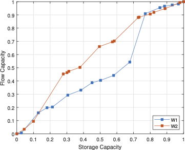

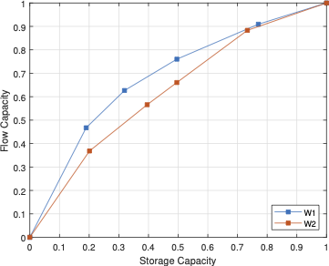
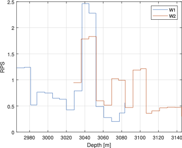

### UNISIM-II-D 

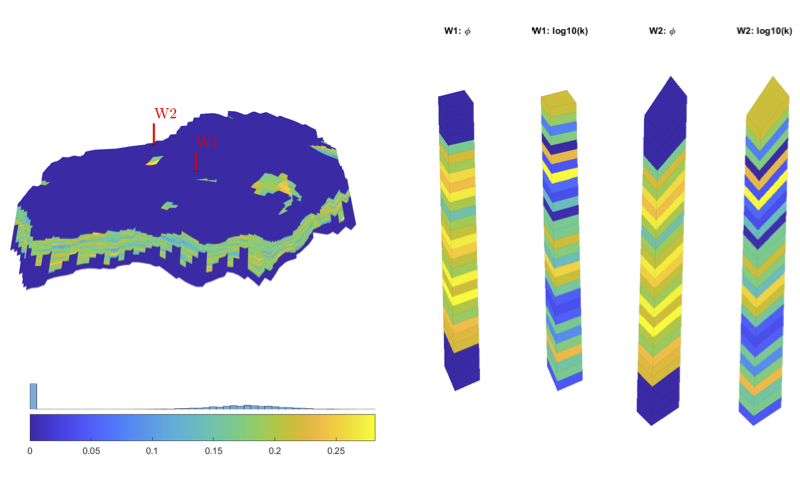
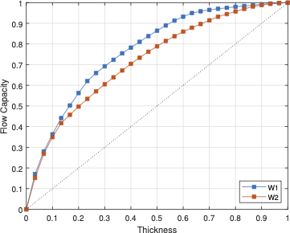

### Norne Field

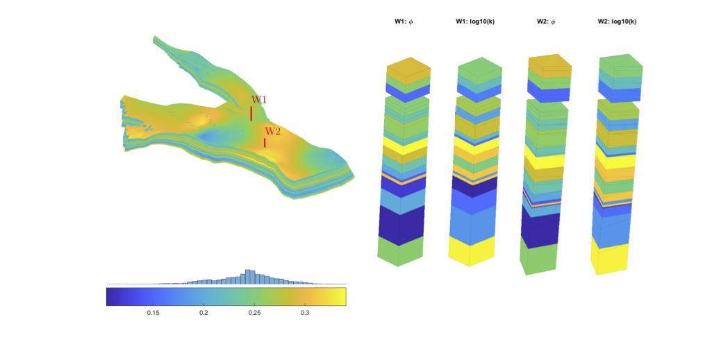
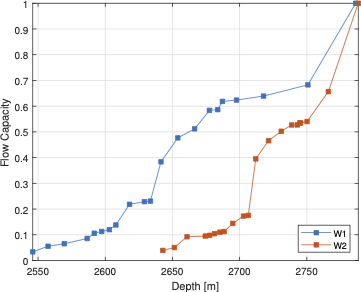

### Egg Model

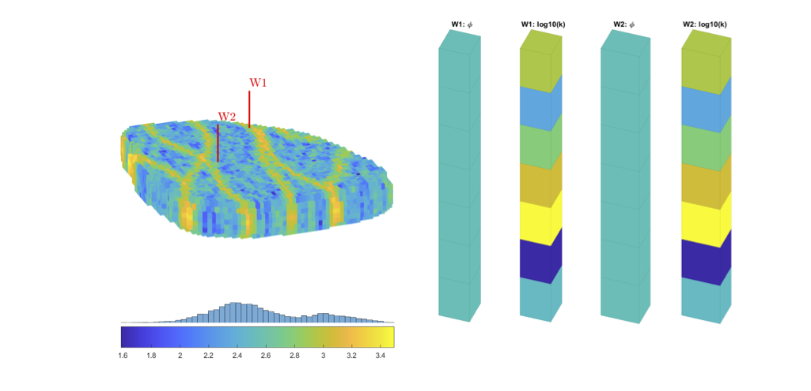
